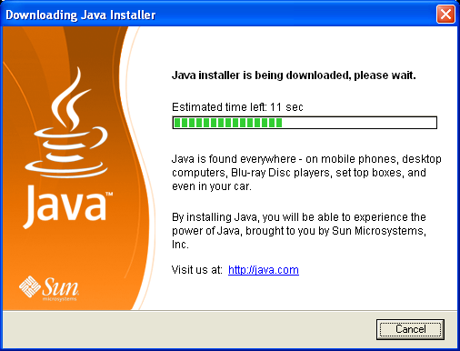

<style>
:root {
  --code-font-size: 1.1rem;
  --code-font-size-px: 14px; /* Main code font size - override in script above */
  --code-line-height: 1.6;
  --code-border: rgba(226, 232, 240, 0.15);
}

.slidev-slide pre,
.slidev-slide .shiki {
  font-size: var(--code-font-size);
  line-height: var(--code-line-height);
  border: 1px solid var(--code-border);
  border-radius: 12px;
  padding: 20px 24px;
  box-shadow: 0 12px 24px rgba(15, 23, 42, 0.3);
}
.slidev-layout pre, .slidev-layout code {
    -webkit-user-select: text;
    user-select: text;
    font-size: 1.05em !important;
    white-space: pre-wrap;
}

/* Boost readability of gray utility text on dark backgrounds */
.slidev-page .text-gray-300 { color: #f1f5f9 !important; }
.slidev-page .text-gray-400 { color: #e2e8f0 !important; }
.slidev-page .text-gray-500 { color: #cbd5e1 !important; }

/* Smaller code for side-by-side layouts */
.compact-code pre, .compact-code .shiki {
  font-size: 0.85rem !important;
  line-height: 1.4 !important;
  padding: 12px 14px !important;
}

/* Large centered quote styling */
.quote-slide {
  display: flex;
  flex-direction: column;
  justify-content: center;
  align-items: center;
  text-align: center;
  padding: 7rem 4rem;
  position: relative;
}
.quote-slide::before {
  content: '"';
  position: absolute;
  left: 40px;
  top: 40%;
  transform: translateY(-50%);
  font-size: 15rem;
  font-weight: 900;
  color: rgba(148, 113, 217, 0.15);
  line-height: 1;
  z-index: 0;
  font-family: cursive;
}
.quote-text {
  font-size: 1.85rem;
  line-height: 1.7;
  font-style: italic;
  color: #f8fafc;
  max-width: 820px;
  font-weight: 500;
  position: relative;
  z-index: 1;
}

.quote-attr {
  font-size: 1.05rem;
  color: #e2e8f0;
  margin-top: 1.5rem;
  font-weight: 500;
}

/* Big statement */
.big-statement p {
  font-size: 3rem;
  font-weight: 700;
  line-height: 1.3;
  text-align: center;
  color: #f8fafc;
  justify-content: center;
  min-height: 100px;
}

div.polaroid {
  width: 80%;
  background-color: white;
  box-shadow: 0 4px 8px 0 rgba(0, 0, 0, 0.2), 0 6px 20px 0 rgba(0, 0, 0, 0.19);
  margin-bottom: 25px;
}

div.container {
  text-align: center;
  padding: 10px 20px;
}
</style>

<script setup>
import { onMounted, onUnmounted } from 'vue'

const boringFeatureEnabled = import.meta.env.VITE_BORING_ENABLED === 'true'
const boringSoundManifestUrl = '/sounds/manifest.json'
const fallbackBoringSounds = [
  '/sounds/quebec.opus',
  '/sounds/quebec1.opus',
  '/sounds/boring-1.wav',
  '/sounds/boring-2.wav',
  '/sounds/boring-3.wav'
]
const boringManifestRefreshMs = 15000
let currentBoringSounds = [...fallbackBoringSounds]
let manifestRefreshTimer = null
let boringPlaybackQueue = []
const activeBoringAudios = new Set()
let boringAudioContext = null
let boringCompressorNode = null
let boringOutputGainNode = null
const boringLogPrefix = '[boring-sound]'

function boringLog(level, message, details) {
  if (details === undefined) {
    console[level](`${boringLogPrefix} ${message}`)
    return
  }
  console[level](`${boringLogPrefix} ${message}`, details)
}

function shuffleArray(items) {
  const result = [...items]
  for (let index = result.length - 1; index > 0; index -= 1) {
    const randomIndex = Math.floor(Math.random() * (index + 1))
    const currentValue = result[index]
    result[index] = result[randomIndex]
    result[randomIndex] = currentValue
  }
  return result
}

async function ensureBoringAudioChain() {
  if (!window.AudioContext && !window.webkitAudioContext) {
    return null
  }

  if (!boringAudioContext) {
    const AudioContextClass = window.AudioContext || window.webkitAudioContext
    boringAudioContext = new AudioContextClass()

    boringCompressorNode = boringAudioContext.createDynamicsCompressor()
    boringCompressorNode.threshold.value = -24
    boringCompressorNode.knee.value = 20
    boringCompressorNode.ratio.value = 8
    boringCompressorNode.attack.value = 0.01
    boringCompressorNode.release.value = 0.25

    boringOutputGainNode = boringAudioContext.createGain()
    boringOutputGainNode.gain.value = 0.95

    boringCompressorNode.connect(boringOutputGainNode)
    boringOutputGainNode.connect(boringAudioContext.destination)

    boringLog('info', 'Initialized boring audio normalization chain')
  }

  if (boringAudioContext.state === 'suspended') {
    await boringAudioContext.resume()
    boringLog('debug', 'Resumed boring audio context')
  }

  return boringAudioContext
}

async function connectAudioToNormalizationChain(audio, url) {
  const context = await ensureBoringAudioChain()
  if (!context || !boringCompressorNode) {
    boringLog('debug', 'Web Audio normalization unavailable, using element volume only', { url })
    return null
  }

  const sourceNode = context.createMediaElementSource(audio)
  sourceNode.connect(boringCompressorNode)
  return sourceNode
}

async function refreshBoringSounds() {
  boringLog('debug', 'Refreshing boring sound manifest', {
    url: boringSoundManifestUrl,
    intervalMs: boringManifestRefreshMs
  })

  return fetch(boringSoundManifestUrl, { cache: 'no-store' })
    .then((response) => {
      if (!response.ok) {
        throw new Error('Failed to load boring sound manifest')
      }
      return response.json()
    })
    .then((manifest) => {
      const files = Array.isArray(manifest?.files) ? manifest.files : []
      const resolved = files
        .filter((file) => typeof file === 'string' && file.trim().length > 0)
        .map((file) => (file.startsWith('/') ? file : `/sounds/${file}`))

      currentBoringSounds = resolved.length > 0 ? [...new Set(resolved)] : [...fallbackBoringSounds]
      boringPlaybackQueue = []
      boringLog('info', 'Resolved boring sound list', {
        fromManifest: resolved.length > 0,
        count: currentBoringSounds.length,
        files: currentBoringSounds
      })
      return currentBoringSounds
    })
    .catch((error) => {
      currentBoringSounds = currentBoringSounds.length > 0 ? currentBoringSounds : [...fallbackBoringSounds]
      boringLog('warn', 'Manifest load failed, using fallback boring sounds', {
        error: String(error),
        count: currentBoringSounds.length,
        files: currentBoringSounds
      })
      return currentBoringSounds
    })
}

function startBoringManifestRefresh() {
  refreshBoringSounds()

  if (manifestRefreshTimer) {
    window.clearInterval(manifestRefreshTimer)
  }

  manifestRefreshTimer = window.setInterval(() => {
    refreshBoringSounds()
  }, boringManifestRefreshMs)
}

function stopBoringManifestRefresh() {
  if (!manifestRefreshTimer) return
  window.clearInterval(manifestRefreshTimer)
  manifestRefreshTimer = null
}

function getCurrentSlideElement(event) {
  const target = event?.target

  if (target instanceof HTMLElement) {
    const closestSlide = target.closest('.slidev-page, .slidev-layout')
    if (closestSlide) {
      return closestSlide
    }
  }

  return document.querySelector('.slidev-page.slidev-page-current, .slidev-page, .slidev-layout')
}

function isNonBoringSlide(event) {
  const slideElement = getCurrentSlideElement(event)
  if (!slideElement) return false

  return (
    slideElement.classList.contains('non-boring') ||
    slideElement.classList.contains('no-boring') ||
    slideElement.dataset.nonBoring === 'true' ||
    slideElement.getAttribute('data-boring') === 'false'
  )
}

function isIgnoredBoringContext(event) {
  if (window.__terminalIsOpen === true) {
    return true
  }

  const activeElement = document.activeElement
  const target = event?.target

  if (activeElement?.tagName === 'IFRAME') {
    return true
  }

  const ignoreSelector = '.modal-overlay, .modal-container, .code-runner, .cm-editor, .terminal-container, [role="dialog"]'
  const inputSelector = 'input, textarea, select, [contenteditable="true"]'

  if (target instanceof HTMLElement) {
    if (target.closest(ignoreSelector) || target.closest(inputSelector)) {
      return true
    }
  }

  if (activeElement instanceof HTMLElement) {
    if (activeElement.closest(ignoreSelector) || activeElement.closest(inputSelector)) {
      return true
    }
  }

  return false
}

async function playRandomBoringSound() {
  const boringSounds = currentBoringSounds
  if (boringSounds.length === 0) {
    boringLog('warn', 'No boring sounds available to play')
    return
  }

  if (boringPlaybackQueue.length === 0) {
    boringPlaybackQueue = shuffleArray(boringSounds)
    boringLog('debug', 'Started new randomized boring sound cycle', {
      cycleLength: boringPlaybackQueue.length,
      queue: boringPlaybackQueue
    })
  }

  const selectedSound = boringPlaybackQueue.shift()
  const shuffledSounds = [selectedSound, ...boringPlaybackQueue]

  boringLog('debug', 'Selected next boring sound from randomized cycle', {
    selected: shuffledSounds[0],
    remainingInCycle: boringPlaybackQueue.length,
    totalCandidatesThisAttempt: shuffledSounds.length
  })

  const tryPlayAtIndex = (index) => {
    if (index >= shuffledSounds.length) {
      boringLog('warn', 'Exhausted boring sounds without successful playback')
      return
    }

    const url = shuffledSounds[index]
    boringLog('debug', 'Attempting to play boring sound', { index, url })

    const audio = new Audio(url)
    audio.volume = 1
    let mediaSourceNode = null

    connectAudioToNormalizationChain(audio, url)
      .then((sourceNode) => {
        mediaSourceNode = sourceNode
        return audio.play()
      })
      .then(() => {
        activeBoringAudios.add(audio)
        if (index > 0) {
          boringPlaybackQueue = boringPlaybackQueue.filter((queuedUrl) => queuedUrl !== url)
        }
        boringLog('info', 'Playing boring sound', { url })

        audio.addEventListener('ended', () => {
          activeBoringAudios.delete(audio)
          if (mediaSourceNode) {
            try {
              mediaSourceNode.disconnect()
            } catch {}
            mediaSourceNode = null
          }
          try {
            audio.pause()
            audio.src = ''
          } catch {}
          boringLog('debug', 'Boring sound ended', { url })
        }, { once: true })

        audio.addEventListener('error', () => {
          activeBoringAudios.delete(audio)
          if (mediaSourceNode) {
            try {
              mediaSourceNode.disconnect()
            } catch {}
            mediaSourceNode = null
          }
          boringLog('warn', 'Boring sound emitted error while playing', { url })
        }, { once: true })
      })
      .catch((error) => {
        boringLog('warn', 'Failed to play boring sound candidate', {
          url,
          error: String(error)
        })
        if (currentBoringSounds) {
          currentBoringSounds = currentBoringSounds.filter((cachedUrl) => cachedUrl !== url)
          boringPlaybackQueue = boringPlaybackQueue.filter((queuedUrl) => queuedUrl !== url)
          boringLog('debug', 'Removed failing boring sound from cache', {
            removed: url,
            remaining: currentBoringSounds.length
          })
        }
        tryPlayAtIndex(index + 1)
      })
  }

  tryPlayAtIndex(0)
}

function handleBoringEnter(event) {
  if (!boringFeatureEnabled) return

  if (event.key !== 'Enter') return

  if (event.defaultPrevented) {
    boringLog('debug', 'Ignoring Enter: default already prevented')
    return
  }
  if (event.repeat) {
    boringLog('debug', 'Ignoring Enter: key repeat')
    return
  }
  if (event.ctrlKey || event.metaKey || event.altKey) {
    boringLog('debug', 'Ignoring Enter: modifier key pressed', {
      ctrl: event.ctrlKey,
      meta: event.metaKey,
      alt: event.altKey
    })
    return
  }
  if (isIgnoredBoringContext(event)) {
    boringLog('debug', 'Ignoring Enter: ignored focus context')
    return
  }
  if (isNonBoringSlide(event)) {
    boringLog('debug', 'Ignoring Enter: slide marked non-boring')
    return
  }

  boringLog('debug', 'Enter accepted: triggering boring sound playback')

  playRandomBoringSound()
}

onMounted(() => {
  // Set code editor font sizes globally
  // Change these values to customize code display across all slides
  const rootElement = document.documentElement
  rootElement.style.setProperty('--code-font-size-px', '14px')

  boringLog('info', 'Boring sound feature initialized', {
    enabled: boringFeatureEnabled,
    manifestUrl: boringSoundManifestUrl,
    manifestRefreshMs: boringManifestRefreshMs
  })

  startBoringManifestRefresh()

  window.addEventListener('keydown', handleBoringEnter)
})

onUnmounted(() => {
  stopBoringManifestRefresh()
  window.removeEventListener('keydown', handleBoringEnter)
})
</script>

<div class="absolute inset-0 bg-black/55 z-0" />

<div class="relative z-10 flex flex-col items-center justify-center h-full">

<div class="text-6xl font-bold leading-tight">Java 26 is boring</div>
<div class="text-3xl mt-4 text-emerald-400 font-semibold">Which is why it is brilliant</div>

<div class="mt-12 text-xl text-gray-500">
Lutske de Leeuw &nbsp;&nbsp;·&nbsp;&nbsp; Johannes Bechberger
</div>

<div class="mt-4 text-lg text-gray-400">Voxxed Days Amsterdam 2026</div>

</div>

<!--
L: Welcome
-->

---
layout: center
---

# Boring.

<v-click>

<div class="text-2xl text-gray-300 mt-8">

Predictable. No surprises. Works at 3 AM.

</div>

<div class="text-xl text-gray-400 mt-4">

Your code still compiles. Your APIs still work.<br/>Your upgrade is not a rewrite.

</div>

</v-click>

<!--
L: "When people hear 'boring tech,' they think old, slow, or not innovative."
-->

---

# Who are we?

<div class="grid grid-cols-2 gap-12 mt-12">

<div class="text-center">

### Lutske

<div class="text-gray-400 mt-4 text-lg">

Java Developer @ Craftsmen<br/>
JUG lead of:<br/>
JUG Noord & Apeldoorn JUG<br/>
Organizer of Devoxx4kids

</div>
</div>

<div class="text-center">

### Johannes

<div class="text-gray-400 mt-4 text-lg">

OpenJDK Developer @ SAP<br/>
Blogger<br/>
<br/>

</div>
</div>

<v-click>

# Boring.
</v-click>

</div>

<!--
L: ""
J:
-->

---
layout: center
---

<div class="big-statement">

What Java version are you on?

</div>

<div class="text-xl text-gray-400 mt-8">


</div>

<!--
L: "Quick show of hands. Who' on Java 28? Liars, it's not out there Who's on 26, 25, 24, 17 11, 8, 5, below 5?"
-->

---
layout: center
---

<div class="big-statement">

Many platforms try to impress you<br/>with <OrangeText>✨shiny rewrites✨</OrangeText> and <RedText> breaking changes 🚨</RedText>

</div>

<v-click>

<div class="text-3xl mt-8 font-semibold text-center">

Java took another path. Java optimizes for <OrangeText>trust</OrangeText>.

</div>

</v-click>

<!--
L: "Most platforms chase shiny new syntax. Java optimizes for something rarer: trust."
[click]
"Trust that your code still compiles. Trust that an upgrade won't turn into a migration project. Trust that what you shipped three years ago still runs. That's thirty years of evidence, not marketing. So when someone calls Java boring, they're paying its biggest compliment."
-->

---
layout: center
---

<div class="big-statement">

Boring by design, since 1995

</div>

<div class="mt-8 text-xl leading-loose">

✅ Simple, object-oriented, and <OrangeText>**familiar**</OrangeText>

✅ **Robust** and **secure**

✅ Architecture-neutral and **portable**

✅ High **performance**

✅ Interpreted, threaded, and dynamic

</div>

<div class="text-sm text-gray-500 mt-6"> The five original design goals, Java Language Specification, 1995</div>

<!--
all Johannes:

If you didn't know it, Java had five original design goals, set out in 1995:

...

"Boring wasn't an accident.
"Simple, object-oriented, and familiar. Not 'revolutionary.' Not 'paradigm-shifting.' Familiar."
"High performance — though early Java was actually quite slow. JIT compilation in 1997 changed everything."
"Java was designed to be boring. And the trust we just talked about? It was baked in from day one."
-->

---
layout: center
---

<div class="big-statement">

How to upgrade to Java 26

</div>

<div class="mt-12">

```xml
<!-- Maven: just change this -->
<maven.compiler.release>26</maven.compiler.release>
```

</div>

<div class="mt-4">

```groovy
// Gradle: just change this
java { toolchain { languageVersion = JavaLanguageVersion.of(26) } }
```

</div>


<div class="text-xl text-gray-400 mt-8">

That's it. Seriously.
</div>

<!--
L: "Upgrading is embarrassingly simple: one property in your pom or toolchain config. Backward compatibility means most apps compile and run without code changes. No rewrite, no migration guide — just bump the number. Boring and brilliant."
-->

---
layout: center
---

<div class="big-statement">

You can write Java 8 code<br/>and <RedText>nobody</RedText> will notice.

</div>

<v-click>

<div class="text-xl mt-8">

The only new syntax:
- `var`
- `switch`/`instanceof`
- `record`
- text blocks

</div>

</v-click>

<!--
all Johannes:

"Here's something people don't realize: the Java language itself hasn't changed that dramatically since Java 8."
[click]
Syntax sugar

"Var is syntax sugar. Records are syntax sugar. Even switch expressions and pattern matching are just evolutions of existing syntax. And hey, we did some research: most of your code doesn't use these new features anyway."

One could argue most Java releases after Java 8 are boring
-->

---
layout: center
---

<div class="big-statement">

The ecosystem is the <OrangeText>real</OrangeText> innovator.

</div>

<!--
Lutske:
Java 26 is boring → ecosystem shines
- Many conferences → ideas spread fast
- JUGs (10 here!) → real discussions, real feedback
- JUG Square → where ideas get challenged & refined

Libraries = where innovation happens
- Open source moves faster than the JDK
- Experiments → libraries → real-world usage
- Proven ideas → eventually become JEPs

Key message
- Innovation starts in the community
- Java stays stable on purpose
- Ecosystem = the real innovator 🚀
-->

---
layout: image-left
image: ./img/Duke_quizmaster.png
---

# How Old Is Your Code?


Guess the Java version!

<div class="text-xl text-orange-400 mt-6 font-mono">

mostlynerdless.de/java-game/

</div>

<div class="text-lg text-gray-400 mt-6">

Phones out. Highest score wins our eternal respect and a t-shirt.
</div>

<!--
Lutske: Johannes had some free time 
Johannes: switches the monitor


L: "Alright, enough setup. Let's have some fun."
"Time to find out how well you really know your Java history."
-->

<!--
[SWITCH TO BROWSER — run the quiz for approximately 10 minutes]

J: runs the game, reads the code snippets aloud, gives hints
L: "provides color commentary and reacts to audience guesses"

"Alright, let's see the final scores!"
J: "Congratulations to our winner! You officially know your Java history."
-->

---
layout: center
---

<div class="big-statement">

Your code was already <span class="text-emerald">boring</span>.

</div>

<!--
Lutske: We did some research… and found that a lot of code still doesn’t use modern features.

So what did we learn?

Complex generics? 2004.
Try-with-resources? 2011.
Records… still feel futuristic, but they’re already 5 years old.

Half of what we call “modern Java” predates your smartphone.

The code you write every day?
It’s built on features that are a decade or even two decades old.
And it still works.

Your code was already boring.
And it still compiles on Java 26.

That’s not a complaint.
That’s an achievement.
-->

---
layout: section
---

<div class="absolute inset-0 flex flex-col items-center justify-between" style="background-image: url('./img/Duke_releasetrain.png'); background-size: cover; background-position: center;">
  <div class="flex-1"></div>
  <div class="text-center pb-12">
    <h1 class="text-white drop-shadow-lg inline-block px-4 py-2 rounded" style="background: rgba(255, 255, 255, 0.15); backdrop-filter: blur(8px);">The Release Train</h1>
  </div>
  <div class="absolute bottom-4 right-4 text-sm text-black">
    Based on <a href="https://www.youtube.com/watch?v=K40XrR67fas" class="text-black">https://www.youtube.com/watch?v=K40XrR67fas
</a>
  </div>
</div>

<!--
all Johannes:

"In the early 1990s, Java was initially developed by James Gosling and his team at Sun Microsystems for a project called “Green Project.” The goal was to create a platform-independent language for consumer electronic devices like interactive TVs, VCRs, and set-top boxes.

However, they realized that the television market wasn’t quite ready for such advanced software. The team then shifted their focus to the burgeoning internet era, where Java found its true calling as a language for web applications. Its “write once, run anywhere” capability became one of its defining features, revolutionizing web development.

"Designed for TV, named after coffee, ended up running 95% of the Fortune 500. Let's look at the before and after."
-->

---

# Before 2017: Chaos

<svg viewBox="-30 0 1060 420" class="w-full" style="font-size: 1px;">
  <!-- Timeline: Java 5 (2004) → Java 9 (2017). 13 years. -->
  <!-- X positions proportional: J5→60  J6→190  J7→512  J8→706  J9→900 -->

  <!-- Main horizontal timeline line -->
  <line x1="30" y1="210" x2="930" y2="210" stroke="#555" stroke-width="2" />

  <!-- === Java 5 (2004) — BOTTOM === -->
  <g>
    <circle cx="60" cy="210" r="14" fill="none" stroke="#666" stroke-width="1.2" />
    <circle cx="60" cy="210" r="9" fill="none" stroke="#666" stroke-width="0.8" />
    <circle cx="60" cy="210" r="4" fill="#00bcd4" />
    <line x1="60" y1="224" x2="60" y2="290" stroke="#00bcd4" stroke-width="1.2" />
    <circle cx="60" cy="290" r="2.5" fill="#00bcd4" />
    <text x="60" y="185" text-anchor="middle" style="font-size: 26px; font-weight: bold;" fill="#00bcd4">Java 5</text>
    <text x="60" y="315" text-anchor="middle" style="font-size: 18px;" fill="white">2004 ☕</text>
    <line x1="-10" y1="335" x2="130" y2="335" stroke="#00bcd4" stroke-width="2" />
  </g>

  <!-- === Java 6 (2006) — TOP — 2 year gap === -->
  <g v-click>
    <line x1="74" y1="210" x2="176" y2="210" stroke="#4caf50" stroke-width="5" opacity="0.5" />
    <circle cx="190" cy="210" r="14" fill="none" stroke="#666" stroke-width="1.2" />
    <circle cx="190" cy="210" r="9" fill="none" stroke="#666" stroke-width="0.8" />
    <circle cx="190" cy="210" r="4" fill="#4caf50" />
    <line x1="190" y1="196" x2="190" y2="130" stroke="#4caf50" stroke-width="1.2" />
    <circle cx="190" cy="130" r="2.5" fill="#4caf50" />
    <text x="190" y="243" text-anchor="middle" style="font-size: 26px; font-weight: bold;" fill="#4caf50">Java 6</text>
    <text x="190" y="120" text-anchor="middle" style="font-size: 18px;" fill="white">2006 — 2 years ⏱️</text>
    <line x1="90" y1="96" x2="290" y2="96" stroke="#4caf50" stroke-width="2" />
  </g>

  <!-- === Java 7 (2011) — BOTTOM — 5 year gap === -->
  <g v-click>
    <line x1="204" y1="210" x2="498" y2="210" stroke="#e91e63" stroke-width="5" opacity="0.5" />
    <circle cx="512" cy="210" r="14" fill="none" stroke="#666" stroke-width="1.2" />
    <circle cx="512" cy="210" r="9" fill="none" stroke="#666" stroke-width="0.8" />
    <circle cx="512" cy="210" r="4" fill="#e91e63" />
    <line x1="512" y1="224" x2="512" y2="290" stroke="#e91e63" stroke-width="1.2" />
    <circle cx="512" cy="290" r="2.5" fill="#e91e63" />
    <text x="512" y="185" text-anchor="middle" style="font-size: 26px; font-weight: bold;" fill="#e91e63">Java 7</text>
    <text x="512" y="315" text-anchor="middle" style="font-size: 18px;" fill="white">2011 — 5 years 💀</text>
    <line x1="412" y1="335" x2="612" y2="335" stroke="#e91e63" stroke-width="2" />
  </g>

  <!-- === Java 8 (2014) — TOP — 3 year gap === -->
  <g v-click>
    <line x1="526" y1="210" x2="692" y2="210" stroke="#ff9800" stroke-width="5" opacity="0.5" />
    <circle cx="706" cy="210" r="14" fill="none" stroke="#666" stroke-width="1.2" />
    <circle cx="706" cy="210" r="9" fill="none" stroke="#666" stroke-width="0.8" />
    <circle cx="706" cy="210" r="4" fill="#ff9800" />
    <line x1="706" y1="196" x2="706" y2="130" stroke="#ff9800" stroke-width="1.2" />
    <circle cx="706" cy="130" r="2.5" fill="#ff9800" />
    <text x="706" y="243" text-anchor="middle" style="font-size: 26px; font-weight: bold;" fill="#ff9800">Java 8</text>
    <text x="706" y="120" text-anchor="middle" style="font-size: 18px;" fill="white">2014 — 3 years ⏱️</text>
    <line x1="606" y1="96" x2="806" y2="96" stroke="#ff9800" stroke-width="2" />
  </g>

  <!-- === Java 9 (2017) — BOTTOM — 3.5 year gap === -->
  <g v-click>
    <line x1="720" y1="210" x2="886" y2="210" stroke="#607d8b" stroke-width="5" opacity="0.5" />
    <circle cx="900" cy="210" r="14" fill="none" stroke="#666" stroke-width="1.2" />
    <circle cx="900" cy="210" r="9" fill="none" stroke="#666" stroke-width="0.8" />
    <circle cx="900" cy="210" r="4" fill="#607d8b" />
    <line x1="900" y1="224" x2="900" y2="290" stroke="#607d8b" stroke-width="1.2" />
    <circle cx="900" cy="290" r="2.5" fill="#607d8b" />
    <text x="900" y="185" text-anchor="middle" style="font-size: 26px; font-weight: bold;" fill="#607d8b">Java 9</text>
    <text x="900" y="315" text-anchor="middle" style="font-size: 18px;" fill="white">2017 — 3.5 years 😤</text>
    <line x1="800" y1="335" x2="1000" y2="335" stroke="#607d8b" stroke-width="2" />
  </g>
</svg>

<!--
Johannes:


J: "The old release model was a mess."
J: "Java 5 to 6: two years. Reasonable. 6 to 7: five years. Five! That's an eternity in tech."
J: "7 to 8: three years. The lambdas release. And 8 to 9: three and a half years. Java 9 was 18 months late because they tried to finish Project Jigsaw — the module system."
L: "And modules were... controversial."
-->

---
layout: center
---

<div class="quote-slide">
  <div class="quote-text">
    "Modules: Enormous upheaval<br/> for minimal concrete benefit."
  </div>
  <div class="quote-attr">— Neil Madden, rating 26 years of Java changes</div>
</div>

<!--
Johannes:

L: "Neil Madden — a very opinionated blogger — rated every major Java feature over 26 years. Modules got minus ten out of ten. And he questioned whether it has any benefit at all."
J: "Now, you can disagree with that rating. But the point is: modules delayed Java 9 by 18 months and broke a lot of build tooling. That's what happens when you try to ship something too big. And that experience led directly to the new model."
-->

---

# After 2017: Cadence

<svg viewBox="-30 0 1060 420" class="w-full" style="font-size: 1px;">
  <!-- Timeline: Java 9 (2017) → Java 17 (2021) -->
  <!-- Equal spacing to show the new 6-month cadence -->
  <!-- X positions: J9→60 J10→170 J11→280 J12→390 J13→500 J14→610 J15→720 J16→830 J17→940 -->

  <!-- Main horizontal timeline line -->
  <line x1="30" y1="210" x2="970" y2="210" stroke="#555" stroke-width="2" />

  <!-- === Java 9 (2017) — TOP === -->
  <g>
    <circle cx="60" cy="210" r="14" fill="none" stroke="#666" stroke-width="1.2" />
    <circle cx="60" cy="210" r="9" fill="none" stroke="#666" stroke-width="0.8" />
    <circle cx="60" cy="210" r="4" fill="#607d8b" />
    <line x1="60" y1="196" x2="60" y2="130" stroke="#607d8b" stroke-width="1.2" />
    <circle cx="60" cy="130" r="2.5" fill="#607d8b" />
    <text x="60" y="243" text-anchor="middle" style="font-size: 26px; font-weight: bold;" fill="#607d8b">Java 9</text>
    <text x="60" y="120" text-anchor="middle" style="font-size: 18px;" fill="white">March 2017</text>
    <line x1="-10" y1="96" x2="130" y2="96" stroke="#607d8b" stroke-width="2" />
  </g>

  <!-- === Java 10 (2018) — TOP — 6 months === -->
  <g v-click>
    <line x1="74" y1="210" x2="156" y2="210" stroke="#00bcd4" stroke-width="5" opacity="0.5" />
    <circle cx="170" cy="210" r="14" fill="none" stroke="#666" stroke-width="1.2" />
    <circle cx="170" cy="210" r="9" fill="none" stroke="#666" stroke-width="0.8" />
    <circle cx="170" cy="210" r="4" fill="#00bcd4" />
    <line x1="170" y1="196" x2="170" y2="130" stroke="#00bcd4" stroke-width="1.2" />
    <circle cx="170" cy="130" r="2.5" fill="#00bcd4" />
    <text x="170" y="243" text-anchor="middle" style="font-size: 26px; font-weight: bold;" fill="#00bcd4">Java 10</text>
    <text x="170" y="120" text-anchor="middle" style="font-size: 18px;" fill="white"> Sep 2017</text>
    <line x1="100" y1="96" x2="240" y2="96" stroke="#00bcd4" stroke-width="2" />
  </g>

  <!-- === Java 11 (2018) — BOTTOM — LTS === -->
  <g v-click>
    <line x1="184" y1="210" x2="266" y2="210" stroke="#4caf50" stroke-width="5" opacity="0.5" />
    <circle cx="280" cy="210" r="18" fill="none" stroke="#4caf50" stroke-width="2" />
    <circle cx="280" cy="210" r="11" fill="none" stroke="#4caf50" stroke-width="1.1" />
    <circle cx="280" cy="210" r="5" fill="#4caf50" />
    <line x1="280" y1="228" x2="280" y2="294" stroke="#4caf50" stroke-width="1.2" />
    <circle cx="280" cy="294" r="2.5" fill="#4caf50" />
    <text x="280" y="185" text-anchor="middle" style="font-size: 26px; font-weight: bold;" fill="#4caf50">Java 11</text>
    <text x="280" y="319" text-anchor="middle" style="font-size: 18px;" fill="white">Sep 2018 ⭐LTS </text>
    <line x1="200" y1="339" x2="360" y2="339" stroke="#4caf50" stroke-width="2" />
  </g>

  <!-- === Java 12 (2019) — TOP === -->
  <g v-click>
    <line x1="294" y1="210" x2="376" y2="210" stroke="#ff9800" stroke-width="5" opacity="0.5" />
    <circle cx="390" cy="210" r="14" fill="none" stroke="#666" stroke-width="1.2" />
    <circle cx="390" cy="210" r="9" fill="none" stroke="#666" stroke-width="0.8" />
    <circle cx="390" cy="210" r="4" fill="#ff9800" />
    <line x1="390" y1="196" x2="390" y2="130" stroke="#ff9800" stroke-width="1.2" />
    <circle cx="390" cy="130" r="2.5" fill="#ff9800" />
    <text x="390" y="243" text-anchor="middle" style="font-size: 26px; font-weight: bold;" fill="#ff9800">Java 12</text>
    <text x="390" y="120" text-anchor="middle" style="font-size: 18px;" fill="white">March 2019</text>
    <line x1="320" y1="96" x2="460" y2="96" stroke="#ff9800" stroke-width="2" />
  </g>

  <!-- === Java 13 (2019) — TOP === -->
  <g v-click>
    <line x1="404" y1="210" x2="486" y2="210" stroke="#9c27b0" stroke-width="5" opacity="0.5" />
    <circle cx="500" cy="210" r="14" fill="none" stroke="#666" stroke-width="1.2" />
    <circle cx="500" cy="210" r="9" fill="none" stroke="#666" stroke-width="0.8" />
    <circle cx="500" cy="210" r="4" fill="#9c27b0" />
    <line x1="500" y1="196" x2="500" y2="130" stroke="#9c27b0" stroke-width="1.2" />
    <circle cx="500" cy="130" r="2.5" fill="#9c27b0" />
    <text x="500" y="243" text-anchor="middle" style="font-size: 26px; font-weight: bold;" fill="#9c27b0">Java 13</text>
    <text x="500" y="120" text-anchor="middle" style="font-size: 18px;" fill="white">Sep 2019</text>
    <line x1="430" y1="96" x2="570" y2="96" stroke="#9c27b0" stroke-width="2" />
  </g>

  <!-- === Java 14 (2020) — TOP === -->
  <g v-click>
    <line x1="514" y1="210" x2="596" y2="210" stroke="#795548" stroke-width="5" opacity="0.5" />
    <circle cx="610" cy="210" r="14" fill="none" stroke="#666" stroke-width="1.2" />
    <circle cx="610" cy="210" r="9" fill="none" stroke="#666" stroke-width="0.8" />
    <circle cx="610" cy="210" r="4" fill="#795548" />
    <line x1="610" y1="196" x2="610" y2="130" stroke="#795548" stroke-width="1.2" />
    <circle cx="610" cy="130" r="2.5" fill="#795548" />
    <text x="610" y="243" text-anchor="middle" style="font-size: 26px; font-weight: bold;" fill="#795548">Java 14</text>
    <text x="610" y="120" text-anchor="middle" style="font-size: 18px;" fill="white">March 2020</text>
    <line x1="540" y1="96" x2="680" y2="96" stroke="#795548" stroke-width="2" />
  </g>

  <!-- === Java 15 (2020) — TOP === -->
  <g v-click>
    <line x1="624" y1="210" x2="706" y2="210" stroke="#f44336" stroke-width="5" opacity="0.5" />
    <circle cx="720" cy="210" r="14" fill="none" stroke="#666" stroke-width="1.2" />
    <circle cx="720" cy="210" r="9" fill="none" stroke="#666" stroke-width="0.8" />
    <circle cx="720" cy="210" r="4" fill="#f44336" />
    <line x1="720" y1="196" x2="720" y2="130" stroke="#f44336" stroke-width="1.2" />
    <circle cx="720" cy="130" r="2.5" fill="#f44336" />
    <text x="720" y="243" text-anchor="middle" style="font-size: 26px; font-weight: bold;" fill="#f44336">Java 15</text>
    <text x="720" y="120" text-anchor="middle" style="font-size: 18px;" fill="white">Sep 2020</text>
    <line x1="650" y1="96" x2="790" y2="96" stroke="#f44336" stroke-width="2" />
  </g>

  <!-- === Java 16 (2021) — TOP === -->
  <g v-click>
    <line x1="734" y1="210" x2="816" y2="210" stroke="#3f51b5" stroke-width="5" opacity="0.5" />
    <circle cx="830" cy="210" r="14" fill="none" stroke="#666" stroke-width="1.2" />
    <circle cx="830" cy="210" r="9" fill="none" stroke="#666" stroke-width="0.8" />
    <circle cx="830" cy="210" r="4" fill="#3f51b5" />
    <line x1="830" y1="196" x2="830" y2="130" stroke="#3f51b5" stroke-width="1.2" />
    <circle cx="830" cy="130" r="2.5" fill="#3f51b5" />
    <text x="830" y="243" text-anchor="middle" style="font-size: 26px; font-weight: bold;" fill="#3f51b5">Java 16</text>
    <text x="830" y="120" text-anchor="middle" style="font-size: 18px;" fill="white">March 2021</text>
    <line x1="760" y1="96" x2="900" y2="96" stroke="#3f51b5" stroke-width="2" />
  </g>

  <!-- === Java 17 (2021) — BOTTOM — LTS === -->
  <g v-click>
    <line x1="844" y1="210" x2="926" y2="210" stroke="#8bc34a" stroke-width="5" opacity="0.5" />
    <circle cx="940" cy="210" r="18" fill="none" stroke="#8bc34a" stroke-width="2" />
    <circle cx="940" cy="210" r="11" fill="none" stroke="#8bc34a" stroke-width="1.1" />
    <circle cx="940" cy="210" r="5" fill="#8bc34a" />
    <line x1="940" y1="228" x2="940" y2="294" stroke="#8bc34a" stroke-width="1.2" />
    <circle cx="940" cy="294" r="2.5" fill="#8bc34a" />
    <text x="940" y="185" text-anchor="middle" style="font-size: 26px; font-weight: bold;" fill="#8bc34a">Java 17</text>
    <text x="940" y="319" text-anchor="middle" style="font-size: 18px;" fill="white">Sep 2021 ⭐ LTS</text>
    <line x1="860" y1="339" x2="1020" y2="339" stroke="#8bc34a" stroke-width="2" />
  </g>
</svg>

<!--
L: Oracle switched to a time-based cadence in 2017: a release every 6months. March and September, like clockwork. Every 2 years one becomes an LTS — Java 25 is the latest. Features ship when ready; the train never slips for unfinished work.
-->

---
layout: center
---

# After 2022: The Train Keeps Moving

<svg viewBox="-30 0 1060 420" class="w-full" style="font-size: 1px;">
  <!-- Timeline: Java 18 (2022) → Java 26 (2026) -->
  <!-- Equal spacing -->
  <!-- X positions: J18→60 J19→170 J20→280 J21→390 J22→500 J23→610 J24→720 J25→830 J26→940 -->

  <!-- Main horizontal timeline line -->
  <line x1="30" y1="210" x2="970" y2="210" stroke="#555" stroke-width="2" />

  <!-- === Java 18 (2022) — TOP === -->
  <g>
    <circle cx="60" cy="210" r="14" fill="none" stroke="#666" stroke-width="1.2" />
    <circle cx="60" cy="210" r="9" fill="none" stroke="#666" stroke-width="0.8" />
    <circle cx="60" cy="210" r="4" fill="#00bcd4" />
    <line x1="60" y1="196" x2="60" y2="130" stroke="#00bcd4" stroke-width="1.2" />
    <circle cx="60" cy="130" r="2.5" fill="#00bcd4" />
    <text x="60" y="243" text-anchor="middle" style="font-size: 26px; font-weight: bold;" fill="#00bcd4">Java 18</text>
    <text x="60" y="120" text-anchor="middle" style="font-size: 18px;" fill="white">March 2022</text>
    <line x1="-10" y1="96" x2="130" y2="96" stroke="#00bcd4" stroke-width="2" />
  </g>

  <!-- === Java 19 (2022) — TOP === -->
  <g v-click>
    <line x1="74" y1="210" x2="156" y2="210" stroke="#009688" stroke-width="5" opacity="0.5" />
    <circle cx="170" cy="210" r="14" fill="none" stroke="#666" stroke-width="1.2" />
    <circle cx="170" cy="210" r="9" fill="none" stroke="#666" stroke-width="0.8" />
    <circle cx="170" cy="210" r="4" fill="#009688" />
    <line x1="170" y1="196" x2="170" y2="130" stroke="#009688" stroke-width="1.2" />
    <circle cx="170" cy="130" r="2.5" fill="#009688" />
    <text x="170" y="243" text-anchor="middle" style="font-size: 26px; font-weight: bold;" fill="#009688">Java 19</text>
    <text x="170" y="120" text-anchor="middle" style="font-size: 18px;" fill="white">Sep 2022</text>
    <line x1="100" y1="96" x2="240" y2="96" stroke="#009688" stroke-width="2" />
  </g>

  <!-- === Java 20 (2023) — TOP === -->
  <g v-click>
    <line x1="184" y1="210" x2="266" y2="210" stroke="#ffc107" stroke-width="5" opacity="0.5" />
    <circle cx="280" cy="210" r="14" fill="none" stroke="#666" stroke-width="1.2" />
    <circle cx="280" cy="210" r="9" fill="none" stroke="#666" stroke-width="0.8" />
    <circle cx="280" cy="210" r="4" fill="#ffc107" />
    <line x1="280" y1="196" x2="280" y2="130" stroke="#ffc107" stroke-width="1.2" />
    <circle cx="280" cy="130" r="2.5" fill="#ffc107" />
    <text x="280" y="243" text-anchor="middle" style="font-size: 26px; font-weight: bold;" fill="#ffc107">Java 20</text>
    <text x="280" y="120" text-anchor="middle" style="font-size: 18px;" fill="white">March 2023</text>
    <line x1="210" y1="96" x2="350" y2="96" stroke="#ffc107" stroke-width="2" />
  </g>

  <!-- === Java 21 (2023) — BOTTOM — LTS === -->
  <g v-click>
    <line x1="294" y1="210" x2="376" y2="210" stroke="#ff9800" stroke-width="5" opacity="0.5" />
    <circle cx="390" cy="210" r="18" fill="none" stroke="#ff9800" stroke-width="2" />
    <circle cx="390" cy="210" r="11" fill="none" stroke="#ff9800" stroke-width="1.1" />
    <circle cx="390" cy="210" r="5" fill="#ff9800" />
    <line x1="390" y1="228" x2="390" y2="294" stroke="#ff9800" stroke-width="1.2" />
    <circle cx="390" cy="294" r="2.5" fill="#ff9800" />
    <text x="390" y="185" text-anchor="middle" style="font-size: 26px; font-weight: bold;" fill="#ff9800">Java 21</text>
    <text x="390" y="319" text-anchor="middle" style="font-size: 18px;" fill="white">Sep 2023 ⭐ LTS</text>
    <line x1="310" y1="339" x2="470" y2="339" stroke="#ff9800" stroke-width="2" />
  </g>

  <!-- === Java 22 (2024) — TOP === -->
  <g v-click>
    <line x1="404" y1="210" x2="486" y2="210" stroke="#e91e63" stroke-width="5" opacity="0.5" />
    <circle cx="500" cy="210" r="14" fill="none" stroke="#666" stroke-width="1.2" />
    <circle cx="500" cy="210" r="9" fill="none" stroke="#666" stroke-width="0.8" />
    <circle cx="500" cy="210" r="4" fill="#e91e63" />
    <line x1="500" y1="196" x2="500" y2="130" stroke="#e91e63" stroke-width="1.2" />
    <circle cx="500" cy="130" r="2.5" fill="#e91e63" />
    <text x="500" y="243" text-anchor="middle" style="font-size: 26px; font-weight: bold;" fill="#e91e63">Java 22</text>
    <text x="500" y="120" text-anchor="middle" style="font-size: 18px;" fill="white">March 2024</text>
    <line x1="430" y1="96" x2="570" y2="96" stroke="#e91e63" stroke-width="2" />
  </g>

  <!-- === Java 23 (2024) — TOP === -->
  <g v-click>
    <line x1="514" y1="210" x2="596" y2="210" stroke="#673ab7" stroke-width="5" opacity="0.5" />
    <circle cx="610" cy="210" r="14" fill="none" stroke="#666" stroke-width="1.2" />
    <circle cx="610" cy="210" r="9" fill="none" stroke="#666" stroke-width="0.8" />
    <circle cx="610" cy="210" r="4" fill="#673ab7" />
    <line x1="610" y1="196" x2="610" y2="130" stroke="#673ab7" stroke-width="1.2" />
    <circle cx="610" cy="130" r="2.5" fill="#673ab7" />
    <text x="610" y="243" text-anchor="middle" style="font-size: 26px; font-weight: bold;" fill="#673ab7">Java 23</text>
    <text x="610" y="120" text-anchor="middle" style="font-size: 18px;" fill="white">Sep 2024</text>
    <line x1="540" y1="96" x2="680" y2="96" stroke="#673ab7" stroke-width="2" />
  </g>

  <!-- === Java 24 (2025) — TOP === -->
  <g v-click>
    <line x1="624" y1="210" x2="706" y2="210" stroke="#4caf50" stroke-width="5" opacity="0.5" />
    <circle cx="720" cy="210" r="14" fill="none" stroke="#666" stroke-width="1.2" />
    <circle cx="720" cy="210" r="9" fill="none" stroke="#666" stroke-width="0.8" />
    <circle cx="720" cy="210" r="4" fill="#4caf50" />
    <line x1="720" y1="196" x2="720" y2="130" stroke="#4caf50" stroke-width="1.2" />
    <circle cx="720" cy="130" r="2.5" fill="#4caf50" />
    <text x="720" y="243" text-anchor="middle" style="font-size: 26px; font-weight: bold;" fill="#4caf50">Java 24</text>
    <text x="720" y="120" text-anchor="middle" style="font-size: 18px;" fill="white">March 2025</text>
    <line x1="650" y1="96" x2="790" y2="96" stroke="#4caf50" stroke-width="2" />
  </g>

  <!-- === Java 25 (2025) — BOTTOM — LTS === -->
  <g v-click>
    <line x1="734" y1="210" x2="816" y2="210" stroke="#f44336" stroke-width="5" opacity="0.5" />
    <circle cx="830" cy="210" r="18" fill="none" stroke="#f44336" stroke-width="2" />
    <circle cx="830" cy="210" r="11" fill="none" stroke="#f44336" stroke-width="1.1" />
    <circle cx="830" cy="210" r="5" fill="#f44336" />
    <line x1="830" y1="228" x2="830" y2="294" stroke="#f44336" stroke-width="1.2" />
    <circle cx="830" cy="294" r="2.5" fill="#f44336" />
    <text x="830" y="185" text-anchor="middle" style="font-size: 26px; font-weight: bold;" fill="#f44336">Java 25</text>
    <text x="830" y="319" text-anchor="middle" style="font-size: 18px;" fill="white">Sep 2025 ⭐ LTS</text>
    <line x1="750" y1="339" x2="910" y2="339" stroke="#f44336" stroke-width="2" />
  </g>

  <!-- === Java 26 (2026) — TOP === -->
  <g v-click>
    <line x1="844" y1="210" x2="926" y2="210" stroke="#3f51b5" stroke-width="5" opacity="0.5" />
    <circle cx="940" cy="210" r="14" fill="none" stroke="#666" stroke-width="1.2" />
    <circle cx="940" cy="210" r="9" fill="none" stroke="#666" stroke-width="0.8" />
    <circle cx="940" cy="210" r="4" fill="#3f51b5" />
    <line x1="940" y1="196" x2="940" y2="130" stroke="#3f51b5" stroke-width="1.2" />
    <circle cx="940" cy="130" r="2.5" fill="#3f51b5" />
    <text x="940" y="243" text-anchor="middle" style="font-size: 26px; font-weight: bold;" fill="#3f51b5">Java 26</text>
    <text x="940" y="120" text-anchor="middle" style="font-size: 18px;" fill="white">March 2026</text>
    <line x1="870" y1="96" x2="1010" y2="96" stroke="#3f51b5" stroke-width="2" />
  </g>
</svg>

<!--
L:
Non-LTS releases like Java 26 still matter: early access to final and preview features without multi-year waits.
-->

---

<div class="quote-slide">
  <div class="quote-text">
    This helps Java remain competitive […] while maintaining its core values of compatibility and reliability.
  </div>
  <div class="quote-attr">— Mark Reinhold</div>
</div>

<!--
Lutske:
Mark Reinhold captured the goal: stay competitive while protecting compatibility and reliability. This mindset is why the release train works , progress without surprises.
-->

---

# Java 26: What's inside

<div class="mt-0 text-base leading-relaxed">

<style>
td {
  padding: 3px;
}
th {
  font-weight: bold;
}
</style>

| JEP | Feature | |
|-----|---------|---|
| 500 | Prepare to Make Final Mean Final | <Badge variant="green">Final</Badge> |
| 504 | Remove the Applet API | <Badge variant="green">Final</Badge> |
| 516 | Ahead-of-Time Object Caching with Any GC | <Badge variant="green">Final</Badge> |
| 517 | HTTP/3 for the HTTP Client API | <Badge variant="green">Final</Badge> |
| 522 | G1 GC: Improve Throughput | <Badge variant="green">Final</Badge> |
| 524 | PEM Encodings of Cryptographic Objects | <Badge variant="blue">2nd Preview</Badge> |
| 525 | Structured Concurrency | <Badge variant="blue">6th Preview</Badge> |
| 526 | Lazy Constants | <Badge variant="blue">2nd Preview</Badge> |
| 529 | Vector API | <Badge variant="gray">11th Incubator</Badge> |
| 530 | Primitive Types in Patterns | <Badge variant="blue">4th Preview</Badge> |

</div>

<!--
Lutske: 
Here’s the full list. Ten JEPs.
Don’t worry, this is just a quick overview, we’ll zoom in later.

Five are final.
Done. Production-ready. You can upgrade and start using them.

Four are in preview.
So yes, you’ll need --enable-preview if you want to try them out.

And one… is incubating.
The Vector API. On its eleventh round.

Eleven.

We’ll come back to that one.

Individually, none of these are big headline features.
But together? They make Java faster, cleaner, and just more pleasant to work with.

Let’s dig into the ones that actually matter.
-->

---
layout: center
---

<div class="big-statement">

<span class="text-emerald">`final`</span> will <span class="text-emerald">finally</span> mean <span class="text-emerald">final</span>.

</div>

<div class="text-xl mt-8">

JEP 500: Prepare to Make Final Mean Final

</div>

<!--
Johannes:

L: "Quick detour: JEP 500 prepares to actually enforce the final keyword."
J: "Right now, you can technically use reflection to change a final field at runtime."
L: "Libraries have been doing this for years — Hibernate, serialization frameworks, test utilities."
J: "In Java 26, the JVM starts warning you. In a future release, it'll be blocked entirely."
-->

---

# What reflection hacks look like today

<CodeRunner slide-id="reflection-hack" :indent=4>

  <template #before>
  
```java
void main() throws java.lang.Exception {
```

  </template>
  <template #default>

```java
// This works today — but it shouldn't
class Config {
    private final String secret = "original";
}

var config = new Config();
var field = Config.class.getDeclaredField("secret");
field.setAccessible(true);
field.set(config, "hacked");  // ← final? What final?
```

  </template>

  <template #after>
  
```java
}
```

  </template>
</CodeRunner>

<v-click>

<div class="text-xl mt-6">

⚠️ **Java 26**: runtime warning<br/>
🚫 **Future release**: blocked entirely

</div>

</v-click>

<!--
Johannes

J: "Here's what people have been doing. You declare a field final. Someone uses reflection to change it anyway."
L: "Wait, that actually works?"
J: "It does. And libraries rely on it — Hibernate for lazy loading, test frameworks for mocking, serialization for deserialization."
[click]
J: "Java 26 starts printing warnings. A future release will throw an exception."
L: "More predictable code, better JIT optimizations, fewer 'how did this field change?!' debugging sessions."
J: "And existing libraries are already adapting. This is how Java evolves: signal, warn, enforce."
-->

---
layout: section
---

# The Invisible <br/> GC Upgrade

JEP 522: G1 GC: Improve Throughput

<!--
Lutske:
Invisible improvements are my favorite: do nothing and your app gets faster. G1 has been the default since Java 9; this JEP reduces synchronization between your app and the GC.
-->

---
layout: center
---

<div class="text-8xl font-bold text-emerald-400">

5–15%

</div>

<div class="text-2xl text-gray-300 mt-6">

more throughput. For free.


*According to the JEP 522.*


</div>

<!--
L: "JEP 522 reduces the synchronization between your application threads and G1's concurrent refinement threads."
J: "In English?"
L: "Your app spends less time waiting for GC bookkeeping. The garbage collector still does the same work, but it gets out of your threads' way faster."
J: "And the improvement?"
L: "Five to fifteen percent better throughput, depending on the workload."

J: "The technical detail: G1 maintains a 'card table' that tracks which parts of memory have been modified. Previously, your application threads would occasionally pause to help process that table."
-->

---
layout: center
---

<div class="big-statement">

Zero lines of code changed. <br/>Just upgrade your JDK.

</div>

<div class="text-3xl text-emerald mt-8 text-center">

This is what boring looks like in practice.

</div>

<!--
Lutske

J: "I want to be real for a second. I don't fully understand GC internals. I know roughly what G1 does, but refinement threads? Card tables? That's not my world."
L: "And it shouldn't be. That's the whole point of boring infrastructure. The GC team does the hard work so you don't have to think about it."
J: "I upgrade the JDK, my app gets faster, and I go back to writing business logic."
L: "That's boring working exactly as intended."
-->

---
layout: section
---

# Ahead of time

JEP 516: Ahead-of-Time Object Caching with Any GC

<!--
Johannes
-->

---

# AOT Object Caching — now with Any GC

<div class="mt-6 text-xl leading-relaxed">

</div>

<div class="mt-6">

```shell
# Training run: JVM records which objects are created at startup
java -XX:AOTCacheOutput=app.aot -jar myapp.jar

# Production: JVM loads pre-built objects — faster startup
java -XX:AOTCache=app.aot -jar myapp.jar
```

</div>

<v-click>

<div class="text-2xl mt-5">Without any changes to your application.</div>

<div class="text-5xl mt-5 text-emerald">
Boring.
</div>

</v-click>

<!--
Johannes

Lutske shouts in Boring

Johannes: It's really it just works

J: "AOT Object Caching is another invisible upgrade. Previously, this only worked with the default G1 collector. Now it works with any GC — ZGC, Shenandoah, Parallel, you name it."
L: "So the app starts faster because Java remembers your app's startup work — and skips it next time. The JVM caches frequently created objects from a training run. On subsequent starts, it loads pre-built objects instead of creating them from scratch."
J: "This is huge for microservices and containerized workloads where cold start time matters."
L: "Faster cold starts, less memory churn at startup, and again — you don't change a single line of application code. Just add a JVM flag. Boring and brilliant, part two."
-->

---
layout: section
---

# HTTP/3 in the Standard Library

JEP 517: HTTP/3 for the HTTP Client API

<!--
Lutske:
L: "Next up: HTTP/3 — the latest version of the web's protocol. It's built on QUIC over UDP with TLS 1.3 baked in. That means faster connection setup, no head-of-line blocking, and better behavior on unreliable networks."
-->

---
layout: center
---

<div class="relative w-full max-w-2xl mx-auto">

<v-click>

<div class="mb-10">
  <div class="flex items-center gap-3 mb-2">
    <span class="text-2xl font-bold text-amber-400">HTTP/1.1</span>
    <span class="text-gray-400 text-lg">— One lane road. One request at a time.</span>
  </div>
  <div class="relative h-12 bg-gray-800 rounded-lg overflow-hidden border border-gray-700">
    <div class="absolute top-0 left-0 w-full h-full flex items-center">
      <div class="h-[2px] w-full bg-gray-600 absolute top-1/2"></div>
      <div class="absolute animate-car-slow">
        <span class="text-2xl">🚗</span>
      </div>
    </div>
  </div>
</div>

</v-click>

<v-click>

<div class="mb-10">
  <div class="flex items-center gap-3 mb-2">
    <span class="text-2xl font-bold text-blue-400">HTTP/2</span>
    <span class="text-gray-400 text-lg">— Multi-lane highway. Multiplexed streams.</span>
  </div>
  <div class="relative h-20 bg-gray-800 rounded-lg overflow-hidden border border-gray-700">
    <div class="absolute top-0 left-0 w-full h-full flex flex-col justify-around py-2">
      <div class="relative h-[2px] bg-gray-600"><div class="absolute animate-car-fast1"><span class="text-xl">🚙</span></div></div>
      <div class="relative h-[2px] bg-gray-600"><div class="absolute animate-car-fast2"><span class="text-xl">🚕</span></div></div>
      <div class="relative h-[2px] bg-gray-600"><div class="absolute animate-car-fast3"><span class="text-xl">🚗</span></div></div>
    </div>
  </div>
</div>

</v-click>

<v-click>

<div class="mb-4">
  <div class="flex items-center gap-3 mb-2">
    <span class="text-2xl font-bold text-emerald-400">HTTP/3</span>
    <span class="text-gray-400 text-lg">— No road at all. Just fly. <em class="text-emerald-600"> (QUIC over UDP)</em></span>
  </div>
  <div class="relative h-20 bg-gradient-to-r from-gray-800 via-sky-950 to-gray-800 rounded-lg overflow-hidden border border-sky-900">
    <div class="absolute top-0 left-0 w-full h-full">
      <div class="absolute animate-plane1"><span class="text-2xl">✈️</span></div>
      <div class="absolute animate-plane2"><span class="text-xl">✈️</span></div>
      <div class="absolute animate-plane3"><span class="text-2xl">✈️</span></div>
      <div class="absolute animate-plane4"><span class="text-lg">✈️</span></div>
      <div class="absolute animate-plane5"><span class="text-xl">✈️</span></div>
      <div class="absolute animate-plane6"><span class="text-lg">✈️</span></div>
      <div class="absolute animate-plane7"><span class="text-2xl">✈️</span></div>
      <div class="absolute animate-plane8"><span class="text-xl">✈️</span></div>
      <div class="absolute animate-plane9"><span class="text-lg">✈️</span></div>
      <div class="absolute animate-plane10"><span class="text-xl">✈️</span></div>
      <div class="absolute w-full h-full opacity-20">
        <div class="absolute top-2 left-[15%] text-white text-xs">☁️</div>
        <div class="absolute top-8 left-[40%] text-white text-xs">☁️</div>
        <div class="absolute top-1 left-[65%] text-white text-xs">☁️</div>
        <div class="absolute top-10 left-[85%] text-white text-xs">☁️</div>
      </div>
    </div>
  </div>
</div>

</v-click>

</div>

<style>
@keyframes car-slow {
  0% { left: -30px; }
  45% { left: 30%; }
  50% { left: 30%; }
  95% { left: calc(100% - 30px); }
  100% { left: calc(100% - 30px); }
}
@keyframes car-fast1 {
  0% { left: -30px; }
  100% { left: calc(100% - 30px); }
}
@keyframes car-fast2 {
  0% { left: -30px; }
  100% { left: calc(100% - 30px); }
}
@keyframes car-fast3 {
  0% { left: -30px; }
  100% { left: calc(100% - 30px); }
}
@keyframes plane1 {
  0% { left: -40px; }
  100% { left: calc(100% - 30px); }
}
@keyframes plane2 {
  0% { left: -30px; }
  100% { left: calc(100% - 25px); }
}
@keyframes plane3 {
  0% { left: -35px; }
  100% { left: calc(100% - 30px); }
}
@keyframes plane4 {
  0% { left: -25px; }
  100% { left: calc(100% - 20px); }
}
@keyframes plane5 {
  0% { left: -30px; }
  100% { left: calc(100% - 25px); }
}
@keyframes plane6 {
  0% { left: -25px; }
  100% { left: calc(100% - 20px); }
}
@keyframes plane7 {
  0% { left: -40px; }
  100% { left: calc(100% - 30px); }
}
@keyframes plane8 {
  0% { left: -30px; }
  100% { left: calc(100% - 25px); }
}
@keyframes plane9 {
  0% { left: -35px; }
  100% { left: calc(100% - 25px); }
}
@keyframes plane10 {
  0% { left: -30px; }
  100% { left: calc(100% - 20px); }
}
.animate-car-slow { position: absolute; animation: car-slow 4s ease-in-out infinite; top: -8px; transform: scaleX(-1); }
.animate-car-fast1 { position: absolute; animation: car-fast1 2.2s linear infinite; top: -6px; transform: scaleX(-1); }
.animate-car-fast2 { position: absolute; animation: car-fast2 2.6s linear infinite 0.4s; top: -6px; transform: scaleX(-1); }
.animate-car-fast3 { position: absolute; animation: car-fast3 2s linear infinite 0.8s; top: -6px; transform: scaleX(-1); }
.animate-plane1 { position: absolute; animation: plane1 1.8s linear infinite; top: 5%; transform: rotate(45deg); }
.animate-plane2 { position: absolute; animation: plane2 2.1s linear infinite 0.3s; top: 20%; transform: rotate(45deg); }
.animate-plane3 { position: absolute; animation: plane3 1.5s linear infinite 0.7s; top: 40%; transform: rotate(45deg); }
.animate-plane4 { position: absolute; animation: plane4 2.4s linear infinite 0.1s; top: 55%; transform: rotate(45deg); }
.animate-plane5 { position: absolute; animation: plane5 1.9s linear infinite 0.5s; top: 30%; transform: rotate(45deg); }
.animate-plane6 { position: absolute; animation: plane6 1.7s linear infinite 0.2s; top: 12%; transform: rotate(45deg); }
.animate-plane7 { position: absolute; animation: plane7 2.3s linear infinite 0.9s; top: 48%; transform: rotate(45deg); }
.animate-plane8 { position: absolute; animation: plane8 1.6s linear infinite 1.1s; top: 65%; transform: rotate(45deg); }
.animate-plane9 { position: absolute; animation: plane9 2.0s linear infinite 0.6s; top: 8%; transform: rotate(45deg); }
.animate-plane10 { position: absolute; animation: plane10 1.4s linear infinite 1.3s; top: 38%; transform: rotate(45deg); }
</style>

<!--
Lutske:
L: "HTTP/1.1 was a single-lane road: one request, one response, wait."
[click]
"HTTP/2 multiplexed like a multi-lane highway."
[click]
"HTTP/3 threw out the road entirely. Built on QUIC over UDP — faster setup, no head-of-line blocking. It basically flies."
-->

---

# Using HTTP/3 in Java 26

<CodeRunner slide-id="http3-example" enable-preview :indent=4>

  <template #before>
  
```java
import java.net.http.*;
import java.net.*;

void main() throws Exception {
```

  </template>
  <template #default>

```java
var client = HttpClient.newBuilder()
    .version(HttpClient.Version.HTTP_3)  // ← just add this
    .build();

var request = HttpRequest.newBuilder()
    .uri(URI.create("https://example.com/api"))
    .build();

var response = client.send(request,
    HttpResponse.BodyHandlers.ofString());
    
System.out.println("Status: " + response.statusCode());
System.out.println("Body: " + response.body().substring(0, Math.min(100, response.body().length())) + "...");
```

  </template>

  <template #after>
  
```java

}
```

  </template>
</CodeRunner>

<!--
J: "Here's what the code looks like. You add one line: .version(HTTP_3). That's it."
L: "Everything else is the same HttpClient API you already know."
[click]
J: "And if the server doesn't support HTTP/3? It falls back to HTTP/2, then HTTP/1.1. Automatically. You literally cannot break anything by enabling it."
-->

---
layout: center
---

<div class="quote-slide">
  <div class="quote-text">
    "You'll be fine without it. HTTP/2 is good enough."
  </div>
<div class="quote-attr">— Unnamed Netty Developer</div>
</div>

<!--
Johannes

L: "Honest moment: do you need HTTP/3? For most backend services sitting behind a load balancer?"
J: "Probably not. HTTP/2 covers the vast majority of use cases."
L: "So why talk about it?"
J: "Because it's the new HTTP standard and Java keeps pace."
-->

---
layout: center
---

<div class="max-w-md mx-auto">
  <CroppedImage src="./img/java-applet.png"/>
</div>

<!--
Lutske: We have some sad news for you


Side note: it's how I created my first web applications in school.


L: "A moment of silence for the Applet API."
J: "..."
L: "Okay that's enough silence."
J: "Java applets were introduced in the very first version of Java in 1995. They were THE way to run interactive content in a browser — before JavaScript was capable of anything serious."
L: "They could do 3D visualization, chess games, scientific simulations, hardware-accelerated graphics. NASA World Wind was an applet."
J: "And now, 31 years later, the API is finally gone."
L: "Deprecated in Java 9 in 2017. Viewer removed in Java 11. And now in Java 26, the entire java.applet package is removed."
J: "Nine years from deprecation to removal. That's how careful Java is."
-->

---

# The rise and fall of Java applets

<svg viewBox="-25 0 535 300" class="w-full" style="font-size: 1px;">
  <!-- Timeline spans 1995–2026 (31 years). X positions proportional to time -->
  <!-- Compressed: 1995→15  2013→280  2017→335  2026→470 -->

  <!-- Main horizontal timeline line -->
  <line x1="15" y1="145" x2="470" y2="145" stroke="#555" stroke-width="1.3" />

  <!-- === 1995: Applets ship (BOTTOM) === -->
<g>
  <circle cx="15" cy="145" r="8" fill="none" stroke="#666" stroke-width="0.8" />
  <circle cx="15" cy="145" r="5.5" fill="none" stroke="#666" stroke-width="0.5" />
  <circle cx="15" cy="145" r="2" fill="#00bcd4" />
  <line x1="15" y1="153" x2="15" y2="195" stroke="#00bcd4" stroke-width="0.8" />
  <circle cx="15" cy="195" r="1.2" fill="#00bcd4" />
  <text x="15" y="132" text-anchor="middle" style="font-size: 14px; font-weight: bold;" fill="#00bcd4">1995</text>
  <text x="15" y="208" text-anchor="middle" style="font-size: 10px;" fill="white">Ships 🎉</text>
  <line x1="-12" y1="220" x2="42" y2="220" stroke="#00bcd4" stroke-width="2" />
  </g>

  <!-- === 2013: Browsers drop (TOP) === -->
  <g v-click>
  <circle cx="280" cy="145" r="8" fill="none" stroke="#666" stroke-width="0.8" />
  <circle cx="280" cy="145" r="5.5" fill="none" stroke="#666" stroke-width="0.5" />
  <circle cx="280" cy="145" r="2" fill="#2196f3" />
  <line x1="280" y1="137" x2="280" y2="100" stroke="#2196f3" stroke-width="0.8" />
  <circle cx="280" cy="100" r="1.2" fill="#2196f3" />
  <text x="280" y="161" text-anchor="middle" style="font-size: 13px; font-weight: bold;" fill="#2196f3">2013</text>
  <text x="280" y="92" text-anchor="middle" style="font-size: 10px;" fill="white">Browsers drop support</text>
  <line x1="218" y1="77" x2="342" y2="77" stroke="#2196f3" stroke-width="2" />
  </g>

  <!-- === 2017: Deprecated (BOTTOM) === -->
  <g v-click>
  <circle cx="335" cy="145" r="8" fill="none" stroke="#666" stroke-width="0.8" />
  <circle cx="335" cy="145" r="5.5" fill="none" stroke="#666" stroke-width="0.5" />
  <circle cx="335" cy="145" r="2" fill="#607d8b" />
  <line x1="335" y1="153" x2="335" y2="195" stroke="#607d8b" stroke-width="0.8" />
  <circle cx="335" cy="195" r="1.2" fill="#607d8b" />
  <text x="335" y="132" text-anchor="middle" style="font-size: 14px; font-weight: bold;" fill="#607d8b">2017</text>
  <text x="335" y="208" text-anchor="middle" style="font-size: 10px;" fill="white">Deprecated ⚠️</text>
  <line x1="293" y1="220" x2="377" y2="220" stroke="#607d8b" stroke-width="2" />
  </g>

  <!-- === 2026: Removed (TOP) === -->
  <g v-click>
  <circle cx="470" cy="145" r="8" fill="none" stroke="#666" stroke-width="0.8" />
  <circle cx="470" cy="145" r="5.5" fill="none" stroke="#666" stroke-width="0.5" />
  <circle cx="470" cy="145" r="2" fill="#9e9e9e" />
  <line x1="470" y1="137" x2="470" y2="100" stroke="#9e9e9e" stroke-width="0.8" />
  <circle cx="470" cy="100" r="1.2" fill="#9e9e9e" />
  <text x="470" y="161" text-anchor="middle" style="font-size: 14px; font-weight: bold;" fill="#9e9e9e">2026</text>
  <text x="470" y="92" text-anchor="middle" style="font-size: 10px;" fill="white">Removed 🪦</text>
  <line x1="435" y1="77" x2="505" y2="77" stroke="#9e9e9e" stroke-width="2" />
  </g>
</svg>

<!--
Johannes

Lutske: Nooo at the end "Not that I really liked it"

J: "The history of applets is wild. Let me speed-run through it."
J: "1995. Java 1.0 ships with applets. For the first time, you could run real software in a browser. 3D, games, simulations."
L: "2013 to 2017. Browsers phase out NPAPI. Chrome, Firefox, Safari — one by one they stopped. By 2017, applets couldn't run in any major browser."
J: "2017. Java 9 officially deprecates the API. 2026 — Java 26 removes it. Chapter closed."
L: "31 years from introduction to removal. And the most remarkable thing? Nobody noticed."
-->

---
---

# A code tombstone

<div class="compact-code mt-4">

```html
<!-- This used to be a thing. Seriously. -->
<applet code="HelloApplet.class" archive="hello-applet.jar"
        width="300" height="120">
  Your browser does not support Java applets.
</applet>
```

</div>

<v-click>

<div class="mt-6">

```java
public class HelloApplet extends Applet {
    @Override
    public void paint(Graphics g) {
        g.drawString("Hello from 1997!", 20, 40);
    }
}
```

</div>

</v-click>

<v-click>

<div class="text-xl mt-6">

The `java.applet` package and `JApplet` are now gone. 🪦

</div>

</v-click>

<!--
L: "For the younger people in the audience: this is what Java applets looked like."
[show HTML]
"You'd embed a Java class in an HTML tag. The browser would download and run it. Cross-platform, in 1995!"
[click - show Java]
J: "The Java code extended the Applet class. You had lifecycle methods — init, start, paint. The browser managed the whole thing."
L: "People built chess engines, 3D protein viewers, Mandelbrot set visualizers. This was cutting edge."
[click]
J: "The entire java.applet package is gone. JApplet is gone. Flash is gone. ActiveX is gone. Silverlight is gone."
L: "All of the 'rich web' technologies from the 90s and 2000s are dead. JavaScript won."
-->

---
layout: center
---

<div class="big-statement">

What applets teach us about Java

</div>

<div class="mt-8 text-xl leading-loose">

📢 **Signal early** — deprecated in Java 9 (2017)

⏳ **Remove slowly** — 9 years of warnings

💥 **Break nothing** — zero practical impact when finally removed

</div>

<v-click>

<div class="text-3xl mt-9">

This is the pattern. This is how <span class="text-emerald">boring</span> works.

</div>

</v-click>

<!--
Lutske:
L: "Applet removal shows the boring pattern: signal early, remove slowly, break nothing."
[click]
"This is the pattern: signal, warn, remove. Boring, and the reason you can trust upgrades. Compare that to the Python 2 to 3 leap that fractured the ecosystem for a decade."
-->

---
layout: section
---

# Preview & Incubating Features

The features that aren't ready yet — and that's okay

<!--
Lutske:
L: "Preview and incubating features need --enable-preview. They're not final yet. Some have been in preview for a while — and that's okay. Stability beats rushing."
-->

---

# Primitive types in patterns <Badge variant="blue">4th Preview</Badge>

<CodeRunner slide-id="primitive-patterns" enable-preview :indent=4>

  <template #before>
  
```java
void main() {
```

  </template>
  <template #default>

```java
// Pattern matching now works with primitive types
Object value = 42;

String result = switch (value) {
    case int i when i > 0    -> "positive: " + i;
    case int i when i < 0    -> "negative: " + i;
    case int i               -> "zero";
    case long l              -> "long: " + l;
    case double d            -> "double: " + d;
    default                  -> "something else";
};

System.out.println(result);
```

  </template>

  <template #after>
  
```java
}
```

  </template>
</CodeRunner>

<!--
Lutske:
L: "Primitive patterns bring pattern matching to int, long, double and friends. Previously it only worked with reference types; now you can match primitives directly without manual unboxing. It's the fourth preview, so it's getting close to final."
-->

---

# Java Puzzler
<Caption> by Cay Horstmann</Caption>


<CodeRunner enable-preview>

```java
record Amount(Number n) {}

Integer value(Amount p) {
    return switch (p) {
        case Amount(int value) -> value;
        case Amount(Number _) -> -1;
        case Amount(Object _) -> -2;
    };
}

void main() {
    System.out.println(value(new Amount(null)));
}
```

</CodeRunner>

<div class="text-base mt-6 flex gap-6 justify-center flex-wrap font-medium">

<div>A) <code>null</code> </div>
<div>B) <code>-1</code></div>
<div>C) <code>-2</code></div>
<div>D) Exception</div>

</div>

<!--
Johannes:

L: "Here's a mind-bender from Cay Horstmann. What happens when we call value with a null component?"
J: "The record pattern deconstructs Amount, but the component is null."
L: "Primitive int pattern? Doesn't match null — primitives can't be null."
J: "But the second case, Amount(Number _), does match! null is a valid value for the reference type Number."
L: "So it returns -1. The underscore means we're not binding the value, just checking the type."
J: "Pattern matching with null reference types can be tricky. Always test your assumptions."
-->

---

# PEM Encodings <Badge variant="blue">2nd Preview</Badge>

<div class="mt-6 text-xl leading-relaxed">

Finally: A standard way to read and write PEM certificates in Java.

</div>

<div class="mt-6">

```java
// Before: dozens of lines of Base64 + header parsing + provider setup
// After:
var pemContent = Files.readString(Path.of("server.pem"));
var cert = PEMDecoder.of().decode(pemContent);
```

</div>

<v-click>

<div class="text-lg mt-6">

Less boilerplate. Fewer security mistakes. Standard API for TLS certs, SSH keys, PKCS#8.

</div>

</v-click>

<!--
Lutske:
L: "PEM is the text format everywhere: TLS certs, SSH keys, PKCS#8. Java finally has a standard API to read and write PEM instead of hand-rolled Base64 parsing."
[click]
"Fewer lines, fewer security mistakes — a small but welcome quality-of-life fix."
-->

---

# Lazy constants <Badge variant="blue">2nd Preview</Badge>

<div class="mt-8">

<CodeRunner slide-id="lazy-constant" enable-preview :indent=4>
  <template #before>

```java
import java.util.function.Supplier;

class ExpensiveService {
    ExpensiveService() {
        System.out.println("ExpensiveService created!");
    }
    void doWork() {
        System.out.println("Doing work...");
    }
}

void main() {
```

  </template>
  <template #default>

```java
    // Initialized only when first accessed — thread-safe, immutable
    Supplier<ExpensiveService> SERVICE =
        LazyConstant.of(() -> {
            System.out.println("Initializing...");
            return new ExpensiveService();
        });

    System.out.println("LazyConstant created (not yet initialized)");
    
    // First call triggers initialization
    var service = SERVICE.get();

    // All subsequent calls return the cached value
    var service2 = SERVICE.get();
```

  </template>
  <template #after>

```java
}
```

  </template>
</CodeRunner>

</div>

<v-click>
<div class="mt-4">
Could you implement it yourself? Yes.

<div class="text-3xl mt-4">
Boring.
</div>
</div>
</v-click>

<!--
Johannes:

L: "Lazy constants let you define values that are only computed when first accessed."
J: "Think of it as a thread-safe, immutable, lazy singleton — built into the platform."
L: "Before this, you'd hand-roll double-checked locking or use a holder class pattern."
J: "Now you just say: compute this when I need it. Done."
L: "Second preview. Should be final soon."
-->

---

# Structured concurrency <Badge variant="blue">6th Preview</Badge>

<div class="compact-code grid grid-cols-2 gap-4 mt-6">
<div>

**Java 8: manual**

<CodeRunner slide-id="structured-concurrency-old" enable-preview :indent=4>

  <template #before>
  
```java
import java.util.concurrent.*;

String fetch(String source) {
    try { Thread.sleep(100); } catch (Exception e) {}
    return "Data from " + source;
}

void main() throws Exception {
```

  </template>
  <template #default>

```java
ExecutorService es =
  Executors.newFixedThreadPool(2);

Future<String> f1 =
  es.submit(() -> fetch("left"));
Future<String> f2 =
  es.submit(() -> fetch("right"));

String r = f1.get() + f2.get();
es.shutdown();

System.out.println(r);
```

  </template>

  <template #after>
  
```java
}
```

  </template>
</CodeRunner>

</div>
<div>

**Java 26: structured**

<CodeRunner slide-id="structured-concurrency-new" enable-preview :indent=4>

  <template #before>
  
```java
import java.util.concurrent.*;

String fetch(String source) {
    try { Thread.sleep(100); } catch (Exception e) {}
    return "Data from " + source;
}

void main() throws Exception {
```

  </template>
  <template #default>

```java
try (var scope = StructuredTaskScope.open()) {

  var f1 = scope.fork(
    () -> fetch("left"));
  var f2 = scope.fork(
    () -> fetch("right"));

  scope.join();
  
  String r = f1.get() + " | " + f2.get();
  
  System.out.println(r);
}
```

  </template>

  <template #after>
  
```java
}
```

  </template>
</CodeRunner>

</div>
</div>

<!--
Lutske:
L: "Structured concurrency treats a group of tasks as one unit — if one fails, the rest are cancelled. On the left is the manual executor/shutdown/error handling; on the right the structured version handles cleanup automatically. Same syntax you know: lambdas, try-with-resources, method calls. Just a better library."
-->

---

# Vector API <Badge variant="gray">11th Incubator</Badge>

<div class="mt-8">

<CodeRunner slide-id="vector-api" enable-preview :indent=4 add-modules="jdk.incubator.vector">
  <template #before>

```java
import jdk.incubator.vector.*;

void main() {
```

  </template>
  <template #default>

```java
    // SIMD: process multiple data points in a single CPU instruction
    VectorSpecies<Float> SPECIES = FloatVector.SPECIES_PREFERRED;

    float[] a = {1.0f, 2.0f, 3.0f, 4.0f, 5.0f, 6.0f, 7.0f, 8.0f};
    float[] b = {1.0f, 1.0f, 1.0f, 1.0f, 1.0f, 1.0f, 1.0f, 1.0f};
    float[] result = new float[a.length];

    // Vector addition using SIMD
    for (int i = 0; i < a.length; i += SPECIES.length()) {
        var va = FloatVector.fromArray(SPECIES, a, i);
        var vb = FloatVector.fromArray(SPECIES, b, i);
        va.add(vb).intoArray(result, i);
    }

    System.out.println("Result: " + java.util.Arrays.toString(result));
```

  </template>
  <template #after>

```java
}
```

  </template>
</CodeRunner>

</div>

<!--
Johannes

J: "The Vector API lets you write code that explicitly uses SIMD — Single Instruction, Multiple Data. One CPU instruction processes multiple values at once."
L: "This looks... low-level."
J: "It is. This is for library authors doing numerical computing, machine learning, search indexing."
L: "So Lucene."
J: "Exactly. Lucene, AI libraries, anything that crunches numbers. Not your average CRUD app."
-->

---
layout: center
---

<div class="text-4xl text-orange-400">

Vector API: 11th incubator.

Structured Concurrency: 6th preview.

</div>

<div class="text-xl text-gray-400 mt-8">

Is this "maturing carefully" or just… stuck?

</div>

<v-click>
<div class="text-3xl mt-6">
Or just <span class="text-emerald">boring</span>?
</div>
</v-click>

<!--
Johannes:
 So the pension age is getting up, who knows

L: "Okay, let's address the elephant in the room."
J: "Vector API — eleventh incubator."
L: "Eleventh?!"
J: "And structured concurrency: sixth preview."
L: "At some point you have to ask — is this still 'maturing carefully' or is it just stuck?"
J: "Fair question. Honest answer: some of these are blocked on other JVM work. Vector API needs Project Valhalla for value types. Structured concurrency depends on Loom stabilization."
L: "So they're not stuck — they're waiting for foundations?"
J: "Right. The preview system works, but it does test your patience."
L: "Still — I'd rather have a feature that's been reviewed six times than one that shipped broken once."
J: "That's the most boring-is-brilliant thing you've said all day."
-->

---
layout: center
---

<div class="big-statement">

  You don't need these yet.<br/>
<span class="text-2xl">They're preview for a reason.</span> <br/>
  <span class="text-3xl">But please try them and give feedback. <br/>That's how they graduate.</span>

</div>

<!--
Lutske: You don't need these yet, they are preview for a reason
[click]
Johannes at the end: As a JDK developer especially the feedback is really important
-->

---

# How to try preview features

<div class="mt-8">

```shell
# Compile with preview features enabled
javac --enable-preview --release 26 MyApp.java

# Run with preview features enabled
java --enable-preview MyApp
```

</div>

<v-click>

<div class="text-xl mt-6">

⚠️ Don't use preview features in production. They may change or disappear.

</div>

</v-click>

<!--
L: "Preview features are for experimentation only. They can change or disappear. Use --enable-preview at compile and runtime, and add the flag to your build tool when you opt in. Share the cautionary tale: a friend shipped string templates early and had to rip them out when they changed."
-->

---
layout: section
---

# Who Is This Really For?

Library developers — and why that matters to you

<!--
Johannes:

L: "Let me be blunt about something."
J: "These features are not for most of you. And that's okay."
[pause]
L: "Vector API. Structured concurrency. The foreign function interface. Panama. Loom."
J: "These are not features most of you will use directly."
L: "So why should we care?"
J: "Because the real audience for these features is library developers."
-->

---

<div class="quote-slide">
  <div class="quote-text">
    "Allowing library developers to write faster, better code means that anyone gets better foundations for their applications. So Java can be proud to be boring."
  </div>
</div>

<!--
L: "The big wins target library authors: virtual threads, FFI, vector API. When they get faster foundations, everyone's apps benefit — that's Java being proudly boring. The point isn't to use every new feature; it's to feel the improvements without changing your code."
-->

---
layout: section
---

# Java's Stability

Why boring is a competitive advantage

<!--
L: "Let's zoom out: how does Java's boring approach stack up against other platforms? Boring only matters relative to the alternatives."
-->

---
layout: center
---

<div class="big-statement">

OpenJDK: Not one company

</div>

<div class="mt-8 text-lg leading-loose">

<v-click>

Many distributions.

All free. All TCK-tested. All interchangeable.

</v-click>

</div>

<!--
Johannes:

J: "This is something most people don't realize about Java."
[click]
J: "OpenJDK — the official reference implementation since Java 7 — is built by dozens of organizations. Oracle, Red Hat, IBM, Microsoft, Amazon, Apple, SAP, Azul, BellSoft, JetBrains, Tencent."
L: "Wait — Microsoft contributes to Java?"
J: "Microsoft has their own OpenJDK build. So does Amazon. So does SAP — that's where I work on it."
[click]
L: "And you can choose any of these distributions. Adoptium, Corretto, Zulu, Liberica, Temurin, SapMachine..."
[click]
J: "All free. All pass the Technology Compatibility Kit. All interchangeable. If one vendor does something you don't like — just switch."
L: "The bus factor for Java isn't one company. It's the entire industry."
J: "Sun open-sourced the JVM in 2006, the full class library in 2007. Richard Stallman himself said this ended the 'Java trap.' And since then, the ecosystem has only grown."
L: "Try getting that level of vendor independence with any other platform."
-->

---

<CroppedImage src="./img/java_25_contributions.avif" alt="Java contributors" />
<ImageAttribution>
  Oracle
</ImageAttribution>

<!--
Johannes
-->

---

# Java by the numbers

<div class="grid grid-cols-2 gap-8 mt-10">

<div class="text-center">
  <div class="text-5xl font-bold text-emerald-400">95%</div>
  <div class="text-lg text-gray-300 mt-2">of Fortune 500 run Java</div>
</div>

<div class="text-center">
  <div class="text-5xl font-bold text-emerald-400">35B+</div>
  <div class="text-lg text-gray-300 mt-2">JVMs running globally</div>
</div>

<div class="text-center">
  <div class="text-5xl font-bold text-emerald-400">30 yr</div>
  <div class="text-lg text-gray-300 mt-2">Top 3 in every ranking</div>
</div>

<div class="text-center">
  <div class="text-5xl font-bold text-emerald-400">69%</div>
  <div class="text-lg text-gray-300 mt-2">on Java 17+ </div>
</div>

<ImageAttribution>New Relic 2025</ImageAttribution>
</div>

<!--
Keep it short
-->

---
layout: center
---

<div class="big-statement">

Your skills don't expire.

</div>

<div class="text-xl mt-8">

A developer who learned Java in 2005 writes modern Java today.

</div>

<!--
L: "Here's what the numbers mean personally. If you invested in Java ten years ago, that investment still pays: your patterns, JVM knowledge, and Spring experience all transfer. Markus Westergren migrated the same codebase from Java 1.4 to 7 to 21 over two decades — skills compounding instead of expiring. Compare that to JavaScript framework churn or the Python 2 to 3 break. In Java, your skills compound. They don't expire."
-->

---
layout: center
---

<div class="big-statement">

"It works on Java 8"<br/>is not a strategy.

</div>

<v-click>

<div class="text-xl text-gray-400 mt-8">

It's technical debt with a smiley face.

</div>

</v-click>

<!--
Johannes

L: "But let's be honest about the dark side of backward compatibility."
J: "Some teams use it as an excuse to never upgrade."
L: "'It works on Java 8' — they say. As if working is an achievement."
[click]
J: "'It works on Java 8' is not a strategy. It's technical debt with a smiley face."
L: "You're missing 8 years of performance improvements. Security patches. Developer experience."
J: "The platform gives you a safe upgrade path. The question is whether your organization takes it."

mention OpenRewrite
-->

---

<div class="quote-slide">
  <div class="quote-text">
    "There is a small but immediate cost of upgrading. There is a huge, potentially catastrophic but not immediate cost of staying on old versions. Until the disasters become visible, people don't want to invest.<br/><br/>Sounds a bit like climate change."
  </div>
  <div class="quote-attr">— Johan Vos</div>
</div>

<!--
Johannes

J: "Johan Vos nailed it with this comparison."
L: "The cost of upgrading is small and immediate. One line in your pom, a day of testing."
J: "The cost of NOT upgrading is huge but invisible — until a CVE hits, or you can't hire, or a library drops support."
L: "The platform gives you a safe path. Whether your organization takes it..."
J: "That's a cultural problem. Not a Java problem."

add dog burning house meme
-->

---

# Honest moment: what Java still lacks

<div class="mt-8 text-xl leading-loose">

❌ **String interpolation**

❌ **Null safety**

❌ **Simpler concurrency**

❌ **Commas after last argument**

❌ **No JSON built-in**

</div>

<v-click>

<div class="text-lg mt-6">

Java is not perfect. We're not here to pretend it is.

</div>

</v-click>

<v-click>

<div class="text-3xl mt-6">

It's <span class="text-emerald">boring</span>.

</div>

</v-click>

<!--
L: "Okay. Honest moment. We've been praising Java for 40 minutes. String interpolation, null-safety, easier concurrency — the gaps are real."
[click]
"Java isn't perfect, but the improvement process is sound. The gaps close slowly and predictably."
-->

---
layout: statement
---

# <OrangeText>Can Java be improved?</OrangeText> Yes.

<!--
L: "Yes, Java can be improved. That's exactly why the steady release train exists."
-->

---
layout: statement
---

# <RedText>Are some existing features not the best?</RedText> Yes.

<!--
L:
-->

---
layout: statement
---

# <BlueText>Does it miss features other languages have?</BlueText> Yes.

<!--
L:
-->

---
layout: statement
---

# <OrangeText>Does it have a huge ecosystem?</OrangeText>
# <RedText>Does it run almost everywhere? </RedText>Also yes.

<!--
Johannes:

J: "This is straight from our article. Can Java be improved? Absolutely."
L: "Are some features not the best? Sure. Streams, modules, the old Date API..."
[click]
J: "But has it been around longer than its competitors? Is it a vibrant community? Is the runtime managed by more than one company? Does it run almost everywhere?"
L: "Also yes. To all of it."
J: "The honest answer isn't 'Java is the best.' It's 'Java is the most reliably good.'"
-->

---
layout: center
---



<ImageAttribution>https://www.chartoasis.com/downloading-and-installing-java-cop3/</ImageAttribution>

<!-- do you remember the installer from around 2009? -->

---
layout: center
---

<div class="big-statement">

Java 26 is <span class="text-emerald">boring</span> —<br/>except for the JVM.

</div>

<v-click>

<div class="text-xl text-gray-400 mt-8">

So upgrading might be great,<br/>even if the language didn't change.

</div>

</v-click>

<!--
Johannes

J: "Java 26 is borig, except for the JVM, as one of my colleagues want me to say."
L: "That's the one-line summary of everything we've shown you today."
J: "The language barely changed. Var, record, switch expressions — still the newest things most people use."
L: "But the JVM? G1 GC, AOT caching, HTTP/3 in the standard library. The runtime is where the action is."
[click]
J: "So upgrading to Java 26 might be the best thing you do this year — even if you don't write a single line of new syntax."
L: "Boring language. Brilliant runtime."


this is a quote of Martin, one of J's colleagues
-->

---
layout: section
---

# Closing

Boring and brilliant

<!--
L: "Let's bring it home. Three things to remember from today."
-->

---

# Like the awesome voice talent:

- Mikael Francoeur
- Kirk Pepperdine
- Pasha Finkelshteyn
- Sandra Parsick
- Ivar Grimstad
- François Martin
- Jasmin Fluri

<!--
These people contributed their boringness
-->

---

# Key takeaways

<div class="flex flex-col justify-center h-full gap-7 px-8">

<v-click>

<div class="text-2xl">

🚀 **Upgrade. Free performance.**<br/>

</div>

</v-click>

<v-click>

<div class="text-2xl">

📚 **New features are for libraries. You benefit anyway.**


</div>

</v-click>

<v-click>

<div class="text-2xl">

🧱 **Boring process. Brilliant results.**<br/>
</div>

</v-click>

</div>

<!--
[click]
L: "First: upgrade. You get free performance — G1 GC, HTTP/3, AOT caching — just bump the version."
[click]
"Second: most new features are for library developers; you benefit when frameworks adopt them."
[click]
"Third: the process is the product — predictable releases, safe previews, backward compatibility."
-->

---
layout: center
---

<div class="big-statement">

<span class="text-emerald">Evolution </span>over <BlueText>revolution</BlueText>

</div>

<div class="text-xl mt-8">

For another 30 years of *boring* Java.

</div>

<!--
L: "Evolution over revolution kept Java alive for 30 years. Careful language design and runtime work should keep it relevant for much longer. No rewrites, no breaking changes — just steady, boring, predictable progress."

-->

---
layout: center
---

# Thank you! 🎉

<div class="grid grid-cols-2 gap-12 mt-12">

<div class="text-center">

### Lutske de Leeuw

<!-- add socials here -->
github.com/Lutske

</div>

<div class="text-center">

### Johannes Bechberger

<!-- add socials here -->
mostlynerdless.de

</div>

</div>

<div class="text-gray-400 ml-50 mt-12 text-lg" style="text-align: center">

](./img/repo_qr.png)

</div>

<!--
Johannes:

Both: "Thank you! We'll be around for questions."
L: "Scan the QR code for the slides and to rate the talk."
J: "And if you want to play more of the Java version quiz — the URL is on my website."
L: "Now go upgrade your JDK."
J: "And tell your manager we said so."
-->
